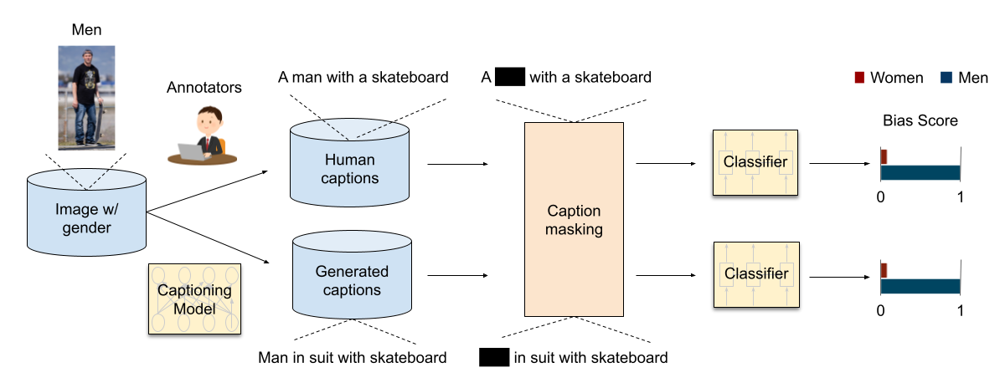
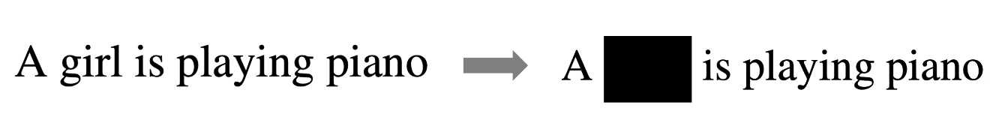
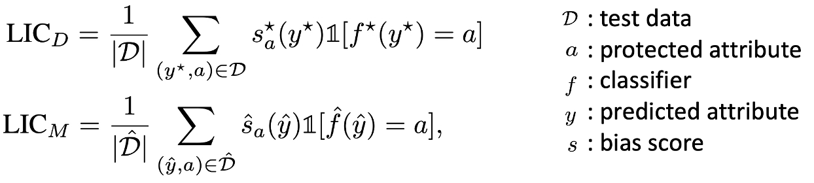
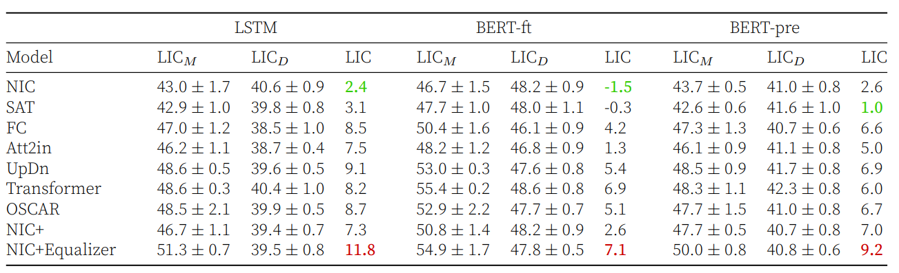
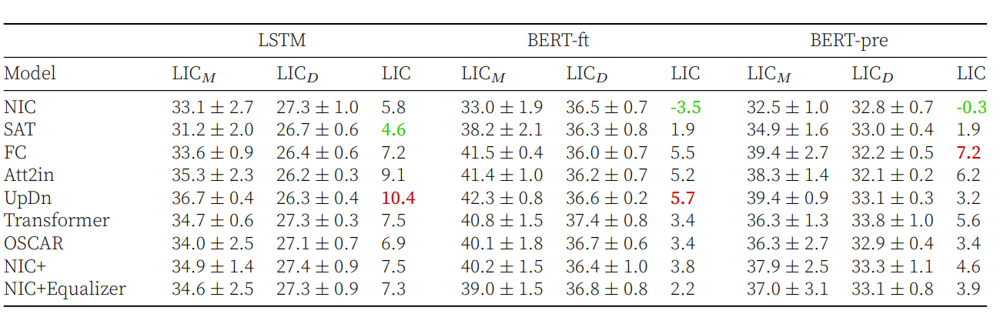
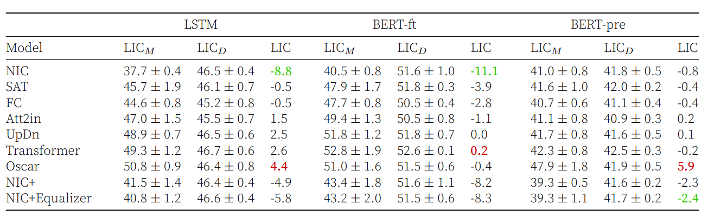
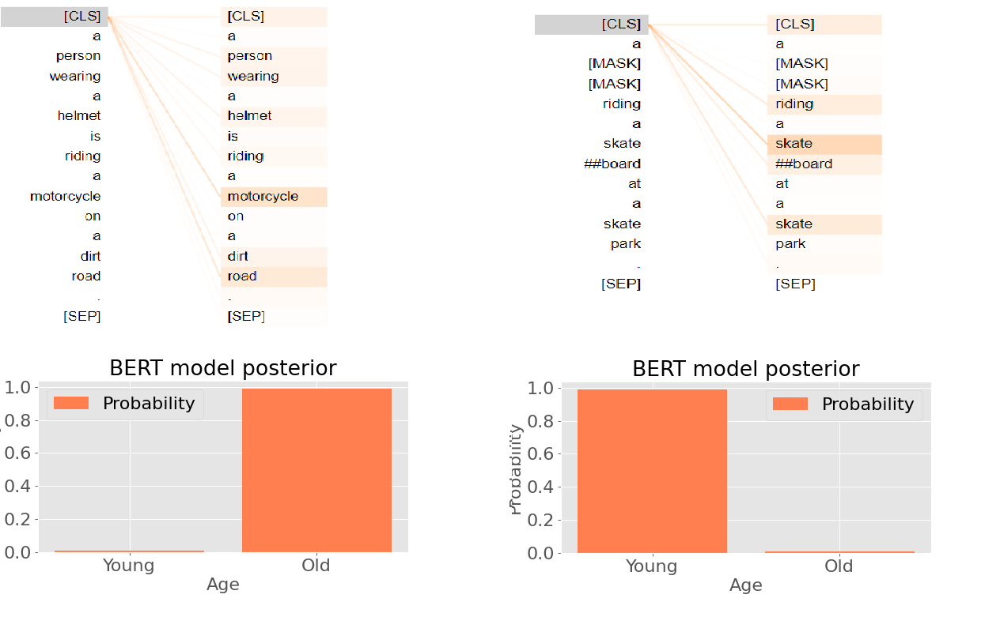
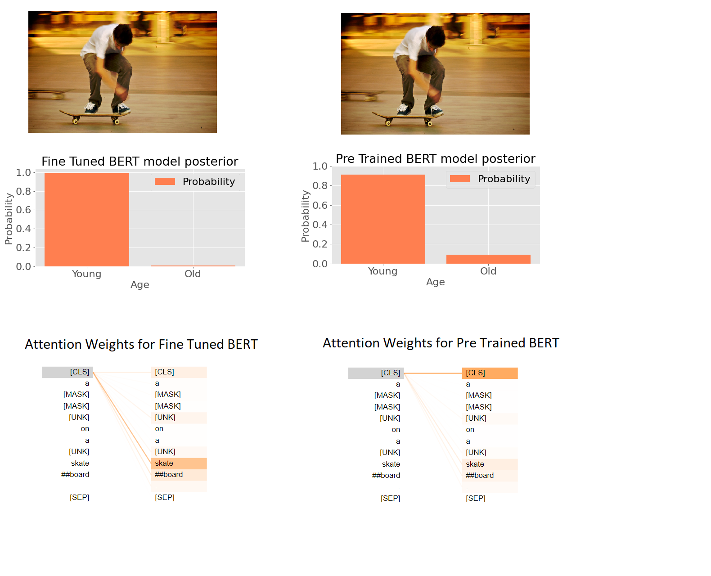
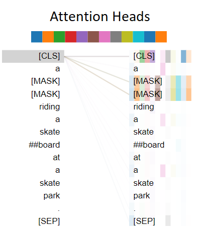

# Reproducing Our Results

Our repository is structured as follows.

* fact-group21 contains the python scripts for runnig the models, as well as .job scripts for running the models in LISA cluster.
    
* fact-group21/Dockerfiles contains dockerfiles for building docker images. We have a lot of environmental requirements, so it is wise to use
this when you do not have access to LISA cluster not UNIX based system. Explanation of how to use docker is out of scope of this repository, 
but we provide commands for getting the models work in docker.[Running Docker Files](#running-docker-files)

* fact-group21/bias_data contains the human annotated and generated captions for each model. This is our entry point to the dataset.
    
* fact-group21/notebooks contains the notebook for running the models in google colab. It is not very important. 
    
* fact-group21/outputs contains the outputs of the model runs, also scripts to parse them into python classes. Therefore, we can have
easier time verifying them. The scripts needs to be executed in ~/fact-group21. For more information about using this script please refer to 
the section [Parsing Results](#parsing-results)

* fact-group21/run_scripts contains a bash file to run all models with specified seeds on partition of dataset 'gender' 'race' or 'age'.

For more information about using the script please refer to the section [Running Models](#running-models)

# Running Models


‼️ Firstly the environment dependencies needs to be installed. 

We only train bert and pretrained bert models in LISA cluster because their computational overhead is not as significant as LSTM.

### Local installation

First of all, make sure you are running python 3.7.
Installing python 3.7 is out of scope for this readme, so it is assumed that you already installed it and it is working properly.

Depending on which model you want to use:

For pre_trained bert and fine tuned bert.
```
python3 -m pip install -r bert_requirements.txt
```

For LSTM.
```
python3 -m pip install -r lstm_requirements.txt
```

Now, you have the environment set up. And ready to run the bash script.


We adapted a bash script to run the models with one command. 

```
bash run_models.sh --model lstm --captions human --data age --epochs 20 --learning_rate 5e-5 > outputs/lstm_human_age.txt
#Run the lstm model with age data using human captions. This produces the LIC_D for lstm model. The output of the bash script needs to be
written in concside manner to outputs directory.
```

For more information about the bashscript please refer to the <a href="https://github.com/fbaratov/fact-group21/tree/main/run_scripts" target="_blank">README </a>
file.


‼️ When saving the output of this bash script use this template: 

```
outputs/model_captions_data.txt
```

‼️ This bash script needs to be executed from ~/fact-group21, otherwise it will throw file not found error.

### LISA Installation 

In LISA, run the bert_env_install.job using

```
sbatch bert_env_install.job
```
After running the job, you can run the models using

```
sbatch bert_gender_generated.job
sbatch bert_gender_human.job
```

The template for finding the .job files is.

```
model_data_captions.job
```

After job is finished, move the .txt file into /outputs file and follow [Parsing Results](#parsing-results).
# Parsing Results

We have developed a script to parse .txt file from the run, into python class.
Calling the function python3 calculate_LIC.py parses the text files and produces results for us to verify and use.
For verification, you can check the epochs, seeds, model names and observe if it is expected.
For result generation, you can use the mean and std of LIC_M and LIC_D results.
As well as LIC results. Which is basically LIC_M - LIC_D


:bangbang: This script needs to be run in ~/fact-group21

:heavy_check_mark: This script is tested using /fact-group21/outputs/test

# Running docker files

First of all make sure to install docker :) 

Follow the directory to the lick-caption-bias, and when you are in the directory execute this command.

<h3> For lstm </h3>

```
docker build -f ./Dockerfiles/Dockerfile_lstm -t lstm_fact . 
docker run -it lstm_fact /bin/bash
#In the container
cd lick-caption-bias
```

<h3> For BERT </h3>

```
docker build -f ./Dockerfiles/Dockerfile_bert -t bert_fact . 
docker run -it bert_fact /bin/bash
#In the container
cd lick-caption-bias
```

You should be in the container now. Go to the lick-caption-bias directory and run the scripts as described below. 


# Quantifying Societal Bias Amplification in Image Captioning
This repository contains source code necessary to reproduce the results presented in the paper [Quantifying Societal Bias Amplification in Image Captioning](https://openaccess.thecvf.com/content/CVPR2022/html/Hirota_Quantifying_Societal_Bias_Amplification_in_Image_Captioning_CVPR_2022_paper.html) (CVPR 2022, Oral). Please check the project website [here](https://sites.google.com/view/cvpr-2022-quantify-bias/home).


<div align="center">

</div>


## LIC metric
LIC metric measures how much biased a set of model generated captions are with respect to the captions in the training dataset. LIC is computer as follows:

1. Mask attribute-revealing words. 
    
<div align="center">

</div>

2. Train 2 classifiers, 1 for human captions and 1 for generated captions, with attribute labels. The classifiers' goal is to predict the attribute (e.g. gender, race) for the person in the image **using only the captions**.

3. Calculate LIC scores for each classifier. If the set of captions is not biased, the classifier accuracy should be close to random chance.

<div align="center">

</div>

4. To compute bias amplification, take the difference of the LIC socres between 2 classifiers.


## Setup
1. Clone the repository.
  /bias_data  folder contains human/generated captions and corresponding gender/racial annotations from the paper [Understanding and Evaluating Racial Biases in Image Captioning](https://github.com/princetonvisualai/imagecaptioning-bias).
2. Install dependancies:
  ### For LSTM classifier
    - Python 3.7
    - numpy 1.21.2 
    - pytorch 1.9
    - torchtext 0.10.0 
    - spacy 3.4.0 
    - sklearn 1.0.2 
    - nltk 3.6.3
    - pandas

  ### For BERT classifier
    - Python 3.7
    - numpy 1.21.2 
    - pytorch 1.4
    - transformers 4.0.1
    - spacy 2.3
    - sklearn 1.0.2 
    - nltk 3.6.3
    - pandas
    
## Compute LIC  
We evaluate various captioning models (i.e. [NIC](https://arxiv.org/abs/1411.4555), [SAT](https://github.com/sgrvinod/a-PyTorch-Tutorial-to-Image-Captioning), [FC](https://github.com/ruotianluo/self-critical.pytorch), [Att2in](https://github.com/ruotianluo/self-critical.pytorch), [UpDn](https://github.com/ruotianluo/self-critical.pytorch/blob/master/MODEL_ZOO.md), [Transformer](https://github.com/ruotianluo/self-critical.pytorch/blob/master/MODEL_ZOO.md), [OSCAR](https://github.com/microsoft/Oscar), [NIC+](https://github.com/kayburns/women-snowboard), and [NIC+Equalizer](https://github.com/kayburns/women-snowboard)). In the following commands, you can select a model in `$model_name` from them (i.e. `nic`, `sat`, `fc`, `att2in`, `updn`, `transformer`, `oscar`, `nic_equalizer`, or `nic_plus`).


In the paper, LSTM or BERT is used as the classifier. Please refer to [Running models](#running-models)
  

## Results

### Gender bias
<div align="center">

</div>

### Racial bias
<div align="center">

</div>


### Age bias
<div align="center">

</div>


**Note**: The classifier is trained 3 times with random initializations except LSTM NIC+ and NIC_Equalizer [10 seeds], and the results are reported by the average and standard deviation.


# Results from bert


### BERT for young-old
<div align="center">

</div>

### Differences between pre-trained and fine-tuned BERT
<div align="center">

</div>

### BERT First Layer Attention Weights 
<div align="center">

</div>

## Citation
    @inproceedings{hirota2022quantifying,
      title={Quantifying Societal Bias Amplification in Image Captioning},
      author={Hirota, Yusuke and Nakashima, Yuta and Garcia, Noa},
      booktitle={Proceedings of the IEEE/CVF Conference on Computer Vision and Pattern Recognition},
      pages={13450--13459},
      year={2022}
     }
